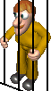

# Anima-CG
Meu trabalho de Computação Gráfica em 2006, desenvolvido em NetBeans com Java 8.

## O que ele faz?
Usando uma engine de jogo, executa a animação que criei para a música "Ela Roubou Meu Caminhão", do Matanza.

## Como executar
Basta abrir o projeto em uma versão do NetBeans/Java equivalente e executar. Quando a janela aparecer, aperte <ENTER> para iniciar a música e a animação.

## Elementos da animação
Exceto pelos personagens e o logotipo "CG TV" (figuras abaixo), todos os demais elementos são desenhados usando formas e transformações geométricas.

     

## Vídeo
Assista esta animação no [YouTube](https://www.youtube.com/watch?v=hWr0y8k9xOE)!
